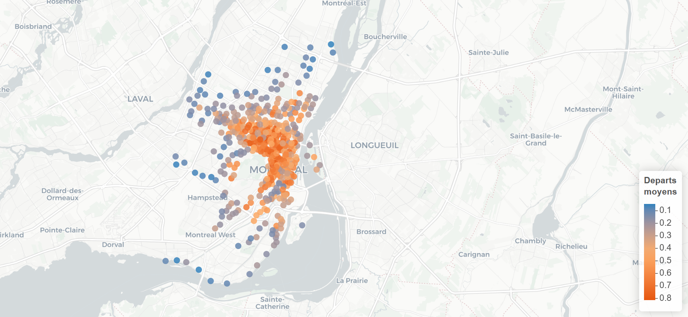

# Prédiction du flux BIXI à Montréal

### −65% RMSE vs baseline naïve | Machine Learning & Regression Kriging (Moran I = 0.595) | 115k observations


---


## Objectif

Prédire le nombre de départs journaliers par station BIXI afin d’optimiser la distribution des vélos et la planification opérationnelle.

Ce projet simule un mandat de conseil pour la Ville de Montréal, avec un focus sur l’amélioration de la performance prédictive à partir de données spatio-temporelles.

---

## Données

- 115 000 observations (stations × jours)  
- Variable cible : nombre de départs journaliers par station  
- Variables explicatives :
  - **Spatiales** : localisation, densité urbaine, infrastructures (walkscore, transports, commerces)  
  - **Temporelles** : jour, saison, jours fériés  
  - **Météorologiques** : température, précipitations, humidité  

- Données couvrant le réseau BIXI de Montréal (587 stations)

Les données présentent une forte hétérogénéité spatiale et temporelle, ainsi que des valeurs manquantes sur la variable cible.

Les données sont disponibles dans `data/raw/BIXI.RData`.  
Source originale : https://bixi.com/fr/donnees-ouvertes

---

## Problème

Les modèles de machine learning classiques supposent l’indépendance des observations.

Or, dans ce contexte :
- les stations proches géographiquement présentent des comportements similaires  
- cette autocorrélation spatiale biaise les modèles standards  

Ignorer cette structure entraîne une perte significative de performance.

---

## Approche

1. Modélisation baseline (ML supervisé)  
   - Random Forest  
   - Gradient Boosting (GBM)  
   - LASSO  

2. Détection de dépendance spatiale  
   - Test de Moran → I = 0.595 (p-value ≈ 0)  
   - Autocorrélation spatiale significative  

3. Correction via Regression Kriging  
   - Modèle hybride :  
     - LASSO pour la composante déterministe  
     - Krigeage pour la structure spatiale résiduelle via ajustement d'un   variogramme sphérique

$$y = f(X) + \varepsilon_{spatial}$$

Trois variantes de krigeage comparées : Ordinaire (OK), Simple (SK), Universel (UK).  

Cette approche permet de capturer la dépendance spatiale non modélisée par les méthodes classiques.

---

## Résultat clé

−65% RMSE vs baseline naïve.

Amélioration substantielle de la performance prédictive, validant l’intérêt d’intégrer la structure spatiale.

---

## Insights principaux

- Walkscore : variable la plus influente  
  → corrélation forte entre densité urbaine et usage BIXI  

- Température : facteur déterminant  
  → augmentation des départs avec de meilleures conditions météo  

- Autocorrélation spatiale  
  → les stations proches présentent des comportements similaires  
  → justification empirique de l’approche géostatistique  

---

## Visualisations


| | |
|---|---|
|  |  |
|  |  |

---
## Modèles testés

- Régression linéaire (stepwise AIC/BIC)  
- Elastic Net  
- Random Forest  
- Gradient Boosting (GBM)  
- LASSO  

Le modèle LASSO a été retenu pour la composante déterministe du Regression Kriging.

---


## Technologies utilisées

**Machine Learning :** `randomForest`, `gbm`, `rpart`, `party`, `glmnet`  
**Analyse spatiale :** `spdep` (test de Moran), `gstat` (krigeage), `sp`  
**Traitement parallèle :** `doParallel`, `foreach`  
**Visualisation :** `ggplot2`, `patchwork`, `leaflet`

---


## Conclusion

L’intégration de la dépendance spatiale via la Regression Kriging améliore significativement la performance par rapport aux approches de machine learning classiques.

Ce projet illustre l’intérêt de combiner méthodes statistiques avancées et compréhension métier pour résoudre des problématiques réelles en environnement urbain.

---

## Structure du repo

```

bixi-montreal-prediction/
├── README.md
├── packages.R                     <- installe tous les packages nécessaires
│
├── R/
│   ├── preprocess.R               <- nettoyage, clustering, split
│   ├── evaluate.R                 <- rmse(), mae(), tableaux, graphiques
│   └── spatial.R                  <- Moran, variogramme, krigeage
│
├── scripts/
│   ├── 00_graphiques_portfolio.R  <- génère les graphiques du README
│   ├── 01_exploration.R           <- EDA + carte interactive
│   ├── 02_baseline_ml.R           <- LASSO, CART, Random Forest, GBM
│   ├── 03_spatial.R               <- Test de Moran + Regression Kriging
│   └── 04_predict.R               <- prédictions finales
│
├── data/
│   ├── raw/
│   │   ├── BIXI.RData             <- données brutes
│   │   └── README.md              <- description des données
│   └── processed/
│
└── outputs/
    └── figures/                <- graphiques exportés

```
---

## Reproduire l'analyse

**1. Installer les packages :**
```r
source("packages.R")
```

**2. Exploration des données :**
```r
source("scripts/01_exploration.R")
```

**3. Modèles ML classiques :**
```r
source("scripts/02_baseline_ml.R")
```

**4. Analyse spatiale et Regression Kriging :**
```r
source("scripts/03_spatial.R")
```

**5. Prédictions finales :**
```r
source("scripts/04_predict.R")
```

**6. Générer les graphiques portfolio :**
```r
source("scripts/00_graphiques_portfolio.R")
```

---

## Auteure

**Sandra Desmair Fogang Lontouo**  
Data Scientist | HEC Montréal
