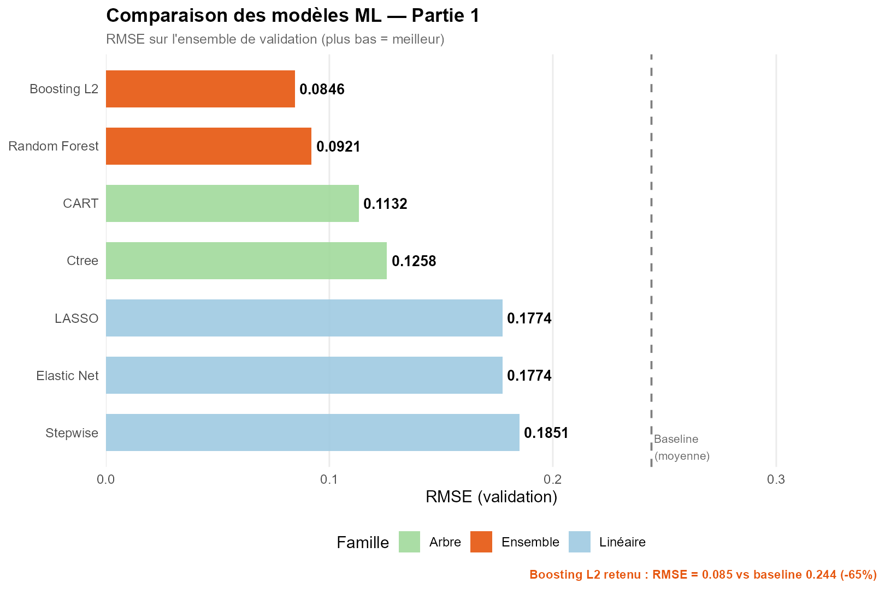
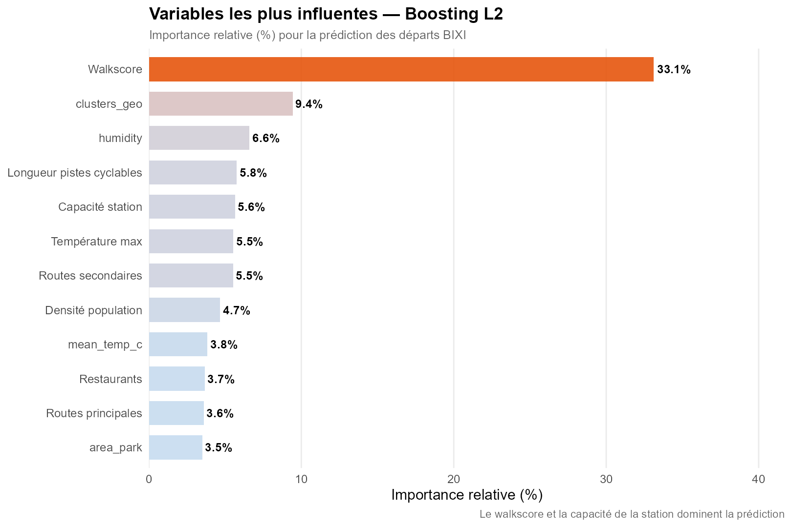
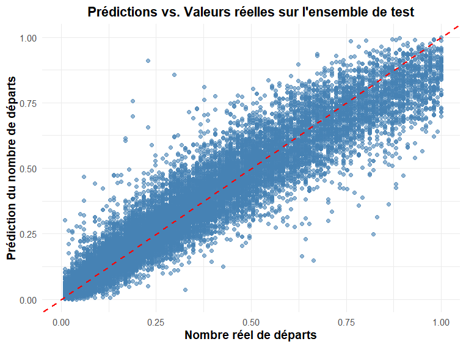

# Prédiction du flux de cyclistes BIXI à Montréal
### Machine Learning & Régression Krigeage — Consultant Ville de Montréal


---

## Objectif

Dans le cadre d'un mandat simulé pour la **Ville de Montréal**, ce projet 
vise à prédire le **nombre de départs journaliers BIXI par station** afin de :

- optimiser l'allocation des vélos
- anticiper les pics de demande
- planifier le développement du réseau de pistes cyclables

---

## Données

- **587 stations BIXI**
- **196 jours (avril - octobre 2019)**
- **~115 000 observations**
- **17 variables explicatives :**
  - 12 variables spatiales (infrastructures, urbanisme)
  - 5 variables temporelles (météo, saison)

Les données sont disponibles dans `data/raw/BIXI.RData`.  
Source originale : https://bixi.com/fr/donnees-ouvertes

---

## Méthodologie

### 1. Modèles classiques (baseline ML)

Hypothèse : indépendance des observations.

- Régression linéaire (Stepwise AIC/BIC)
- LASSO / Elastic Net
- Random Forest
- Gradient Boosting (GBM)
- CART / Ctree

### 2. Analyse spatiale

Test de Moran sur les résidus des modèles classiques → détection d'une 
**forte autocorrélation spatiale**.  
Conclusion : les modèles classiques sont insuffisants — une modélisation 
spatiale explicite est nécessaire.

### 3. Modèle final — Regression Kriging

Approche hybride en deux composantes :

- **Partie déterministe** : LASSO (sélection de variables, validation 
  croisée 10-fold)
- **Partie spatiale** : krigeage des résidus via ajustement d'un 
  variogramme sphérique

$$y = f(X) + \varepsilon_{spatial}$$

Trois variantes de krigeage comparées : Ordinaire (OK), Simple (SK), 
Universel (UK).

---

## Aperçu visuel

| | |
|---|---|
| [Carte interactive des départs](outputs/figures/01_carte_chaleur_montreal.html) |  |
|  |  |

---

## Résultats clés

### Partie 1 — Modèles classiques

| Modèle | RMSE (validation) | MAE (validation) |
|--------|------------------|-----------------|
| Stepwise | 0.1851 | 0.1357 |
| LASSO / Elastic Net | 0.1774 | 0.1386 |
| CART | 0.1132 | 0.0827 |
| Ctree | 0.1258 | 0.0920 |
| Random Forest | 0.0921 | 0.0672 |
| **Boosting L2 (GBM)** | **0.0846** | **0.0620** |

Meilleur modèle Partie 1 : **Boosting L2** — RMSE = 0.0846 vs baseline 0.244 **(−65%)**

### Partie 2 — Regression Kriging

| Modèle | RMSE (validation) | RMSE (test) |
|--------|------------------|-------------|
| LASSO seul | 0.192 | 0.197 |
| LASSO + Krigeage Ordinaire (OK) | 0.187 | 0.176 |
| **LASSO + Krigeage Simple (SK)** | **0.185** | **0.174** |
| LASSO + Krigeage Universel (UK) | 0.190 | 0.173 |

Modèle retenu : **LASSO + Krigeage Simple (SK)**

---

## Insights principaux

- Le **walkscore** est la variable la plus influente (33.1% d'importance)
- La **zone géographique** capture l'effet spatial local (9.4%)
- La **température** et les **pistes cyclables** jouent un rôle secondaire
- Le centre-ville concentre significativement plus de départs
- Le krigeage améliore les prédictions en capturant la dépendance 
  spatiale résiduelle non expliquée par le ML

---

## Structure du repo

```

bixi-montreal-prediction/
├── README.md
├── packages.R                     <- installe tous les packages nécessaires
│
├── R/
│   ├── preprocess.R               <- nettoyage, clustering, split
│   ├── evaluate.R                 <- rmse(), mae(), tableaux, graphiques
│   └── spatial.R                  <- Moran, variogramme, krigeage
│
├── scripts/
│   ├── 00_graphiques_portfolio.R  <- génère les graphiques du README
│   ├── 01_exploration.R           <- EDA + carte interactive
│   ├── 02_baseline_ml.R           <- LASSO, CART, Random Forest, GBM
│   ├── 03_spatial.R               <- Test de Moran + Regression Kriging
│   └── 04_predict.R               <- prédictions finales
│
├── data/
│   ├── raw/
│   │   ├── BIXI.RData             <- données brutes
│   │   └── README.md              <- description des données
│   └── processed/
│
└── outputs/
    └── figures/                <- graphiques exportés

```
---

## Reproduire l'analyse

**1. Installer les packages :**
```r
source("packages.R")
```

**2. Exploration des données :**
```r
source("scripts/01_exploration.R")
```

**3. Modèles ML classiques :**
```r
source("scripts/02_baseline_ml.R")
```

**4. Analyse spatiale et Regression Kriging :**
```r
source("scripts/03_spatial.R")
```

**5. Prédictions finales :**
```r
source("scripts/04_predict.R")
```

**6. Générer les graphiques portfolio :**
```r
source("scripts/00_graphiques_portfolio.R")
```

---

## Technologies utilisées

**Machine Learning :** `randomForest`, `gbm`, `rpart`, `party`, `glmnet`  
**Analyse spatiale :** `spdep` (test de Moran), `gstat` (krigeage), `sp`  
**Traitement parallèle :** `doParallel`, `foreach`  
**Visualisation :** `ggplot2`, `patchwork`, `leaflet`

---

## Auteure

**Sandra Desmair Fogang Lontouo**  
Data Scientist | HEC Montréal
